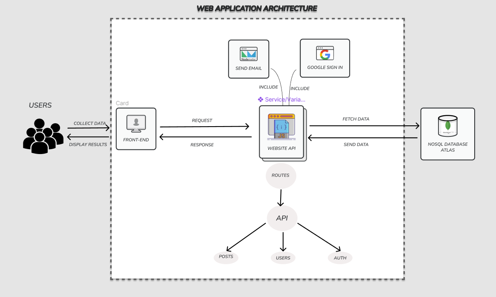

<div id="top"></div>

[![GitHub commit activity][commit-shield]][commit-url]
[![GitHub issues][issues-shield]][issues-url]
[![GitHub pull requests][pr-shield]][pr-url]
[![GitHub contributors][contributor-shield]][contributor-url]

<!-- PROJECT LOGO -->
<br />
<div align="center">
  <a href="https://github.com/mkkasem/fromTo">
    
  </a>

  <h3 align="center">From To</h3>

  <p align="center">
    FromTo is a simple online classified and shopping platform in which people and businesses buy and sell <br/> real estate, cars, and a broad variety of goods and services. Registration and posting listings are free of charge.
    <br />
    <br />
    ·
    <a href="https://github.com/mkkasem/fromTo/issues">Report Bug</a>
    ·
    <a href="https://github.com/mkkasem/fromTo/issues">Request Feature</a>
  </p>
</div>

<!-- TABLE OF CONTENTS -->
<details>
  <summary>Table of Contents</summary>
  <ol>
    <li>
      <a href="#about-the-project">About The Project</a>
      <ul>
      <li><a href="#features">Features</a></li>
      <li><a href="#built-with">Built With</a></li>
      <li><a href="#screenshots">Screenshots</a></li>
      </ul>
    </li>
    <li>
      <a href="#getting-started">Getting Started</a>
      <ul>
        <li><a href="#prerequisites">Prerequisites</a></li>
        <li><a href="#installation">Installation</a></li>
      </ul>
    </li>
    <li><a href="#team">Team</a></li>
    <li><a href="#contributing">Contributing</a></li>
    <li><a href="#license">License</a></li>
    <li><a href="#acknowledgments">Acknowledgments</a></li>
  </ol>
</details>

<!-- ABOUT THE PROJECT -->

## About The Project

From to will help buy and sell anything using the website in Syria. In our Country, unfortunately most people find difficulties marketing their stuff. The platform aims to meet those needs. The user can filter items, add items, comment on a post and many other things.

<p align="right">(<a href="#top">back to top</a>)</p>

## Features

- List available posts to sell
- CRUD operations for users
- CRUD operations for posts
- two types of users (normal, admin)
- Filter items in many different ways
- Factory design pattern
- server side rendering using ejs
- add comment on posts
- Register/Login
  - Allow Google, facebook, Classic
- forget password feature
- Middleware for admin, post, and user

<p align="right">(<a href="#top">back to top</a>)</p>

### Built With

- [Node.js](https://nodejs.org/en/)
- [Express.js](https://expressjs.com/)
- [MongoDB](https://www.mongodb.com/)
- [Nodemailer](https://nodemailer.com/about/)
- [ESLint](https://eslint.org/)
- [Husky](https://github.com/typicode/husky)
- [Ejs](https://ejs.co/)

<p align="right">(<a href="#top">back to top</a>)</p>

# Screenshots

### System Architecture Design



### Add Post


### Homepage


<!-- GETTING STARTED -->

## Getting Started

### Prerequisites

first you need to have node installed on your machine and then :

- yarn
  ```sh
  npm install --global yarn
  ```

### Installation

1. Clone the repo
   ```sh
   git clone https://github.com/mkkasem/fromTo
   ```
2. Navigate to the project folder

   ```sh
   cd fromTo
   ```

3. Install dependencies
   ```sh
   yarn
   ```
4. Run the project
   ```sh
   yarn start
   ```
5. open the browser and add in the url this link
   ```sh
   http://localhost:3000/
   ```
   <p align="right">(<a href="#top">back to top</a>)</p>
   

## Team

| [<br><sub>@mkkasem</sub>](https://github.com/mkkasem) | [<br><sub>@ehabhalil</sub>](https://github.com/ehabhalil) |
| :---------------------------------------------------------------------------------------------------------------------------------------------: | :----------------------------------------------------------------------------------------------------------------------------------------------: |

<!-- ROADMAP -->
<!-- CONTRIBUTING -->

## Contributing

Contributions are what make the open source community such an amazing place to be learn, inspire, and create. Any contributions you make are **greatly appreciated**.

1. Fork the Project
2. Create your Feature Branch (`git checkout -b feature/AmazingFeature`)
3. Commit your Changes (`git commit -m 'Add some AmazingFeature'`)
4. Push to the Branch (`git push origin feature/AmazingFeature`)
5. Open a Pull Request
<!-- LICENSE -->

## License

Distributed under the MIT License. See `LICENSE` for more information.

<!-- ACKNOWLEDGEMENTS -->

## Acknowledgements

- [![google-shield]][google-url]
- [![stackoverflow-shield]][stackoverflow-url]
- [![MDN Web Docs]][mdn-url]
  <!-- MARKDOWN LINKS & IMAGES -->
  <!-- https://www.markdownguide.org/basic-syntax/#reference-style-links -->
  [license-shield]: https://img.shields.io/github/license/RCDD-202110-TUR-BEW/backend-capstone-turkey-bursapediary.svg?style=flat-square
  [license-url]: https://github.com/RCDD-202110-TUR-BEW/backend-capstone-turkey-bursapediary/blob/master/LICENSE
  [freecodecamp-shield]: https://img.shields.io/badge/-freecodecamp-black?style=flat-square&logo=freecodecamp
  [freecodecamp-url]: https://www.freecodecamp.org/
  [google-shield]: https://img.shields.io/badge/google-4285F4?style=for-the-badge&logo=google&logoColor=white
  [google-url]: https://www.google.com/
  [stackoverflow-shield]: https://img.shields.io/badge/-stackoverflow-E34F26?style=for-the-badge&logo=stackoverflow&logoColor=white
  [stackoverflow-url]: https://www.stackoverflow.com/
  [html-shield]: https://img.shields.io/badge/-HTML5-E34F26?style=flat-square&logo=html5&logoColor=white
  [html-url]: https://en.wikipedia.org/wiki/HTML
  [css-shield]: https://img.shields.io/badge/-CSS3-1572B6?style=flat-square&logo=css3
  [css-url]: https://en.wikipedia.org/wiki/CSS
  [nodejs-shield]: https://img.shields.io/badge/-Nodejs-black?style=flat-square&logo=Node.js
  [nodejs-url]: https://nodejs.org/en/
  [react-shield]: https://img.shields.io/badge/-React-black?style=flat-square&logo=react
  [react-url]: https://reactjs.org/
  [mongodb-shield]: https://img.shields.io/badge/-MongoDB-black?style=flat-square&logo=mongodb
  [mongodb-url]: https://www.mongodb.com/
  [express-shield]: https://img.shields.io/badge/-express-black.svg?style=flat-square&logo=express
  [express-url]: https://expressjs.com/
  [graphql-shield]: https://img.shields.io/badge/-GraphQL-E10098?style=flat-square&logo=graphql
  [graphql-url]: https://graphql.org/
  [apollo-shield]: https://img.shields.io/badge/-Apollo%20GraphQL-311C87?style=flat-square&logo=apollo-graphql
  [apollo-url]: https://www.apollographql.com/
  [heroku-shield]: https://img.shields.io/badge/-Heroku-430098?style=flat-square&logo=heroku
  [heroku-url]: https://dashboard.heroku.com/
  [netlify-shield]: https://img.shields.io/badge/-netlify-black?style=flat-square&logo=netlify
  [netlify-url]: https://www.netlify.com/
  [git-shield]: https://img.shields.io/badge/-Git-black?style=flat-square&logo=git
  [git-url]: https://git-scm.com/
  [github-shield]: https://img.shields.io/badge/-GitHub-181717?style=flat-square&logo=github
  [github-url]: https://github.com/
  [linkedin-shield]: https://img.shields.io/badge/-linkedin-blue?style=flat-square&logo=Linkedin&logoColor=white
  [linkedin-url]: https://linkedin.com/

<p align="right">(<a href="#top">back to top</a>)</p>

<!-- MARKDOWN LINKS & IMAGES -->
<!-- https://www.markdownguide.org/basic-syntax/#reference-style-links -->

[commit-shield]: https://img.shields.io/github/commit-activity/m/mkkasem/fromto?color=%233fa037&style=for-the-badge
[commit-url]: https://github.com/mkkasem/fromTo/graphs/commit-activity
[issues-shield]: https://img.shields.io/github/issues-raw/mkkasem/fromTo?color=%233fa037&style=for-the-badge
[issues-url]: https://github.com/mkkasem/fromTo/issues
[pr-shield]: https://img.shields.io/github/issues-pr/mkkasem/fromto?color=%233fa037&style=for-the-badge
[pr-url]: https://github.com/mkkasem/fromTo/pulls
[contributor-shield]: https://img.shields.io/github/contributors/mkkasem/fromto?color=%233fa037&style=for-the-badge
[contributor-url]: https://github.com/mkkasem/fromto/graphs/contributors
[stackoverflow-shield]: https://img.shields.io/badge/-stackoverflow-E34F26?style=for-the-badge&logo=stackoverflow&logoColor=white
[stackoverflow-url]: https://www.stackoverflow.com/
[mdn web docs]: https://img.shields.io/badge/MDN_Web_Docs-black?style=for-the-badge&logo=mdnwebdocs&logoColor=white
[mdn-url]: https://developer.mozilla.org/en-US/
[npm]: https://img.shields.io/badge/NPM-%23000000.svg?style=for-the-badge&logo=npm&logoColor=white
[npm-url]: https://www.npmjs.com/
